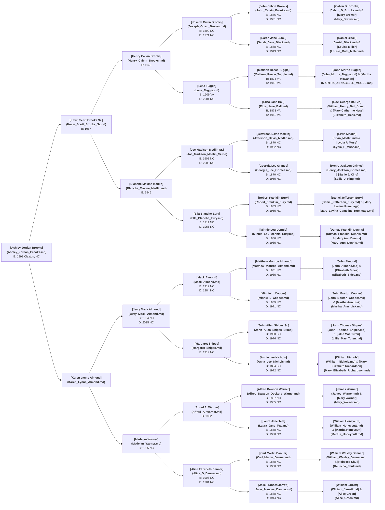

# Family Tree

Verified family history through **Generation 6 (3x Great-Grandparents)**. 

---

## 🌳 Jeremy Daniel Wood's Pedigree

```mermaid
graph LR
    J["<b>[Jeremy Daniel Wood](Jeremy_Wood.md)</b><br/>B: 1992 Wilmington, NC"]
    
    J --> F["<b>[Jason Bard Waters](Jason_Bard_Waters.md)</b><br/>B: 1970<br/>M: 1990 Charlotte, NC"]
    J --> M["<b>[Kimberly Wood](Kimberly_Wood.md)</b><br/>B: 1975"]
    
    F --> F_F["<b>[Mike Waters](Mike_Waters.md)</b><br/>B: 1946"]
    F --> F_M["<b>[Sandra Waters](Sandra_Waters.md)</b><br/>B: 1947"]
    
    F_F --> F_F_F["<b>[Gerald Lee Waters](Gerald_Lee_Waters.md)</b>"]
    F_F --> F_F_M["<b>[Mary Mae Lewis](Mary_Mae_Lewis.md)</b>"]
    
    F_F_F --> F_F_F_F["<b>[Oscar Rae Waters](Oscar_Rae_Waters.md)</b><br/>B: 1890 Dukes, FL<br/>D: 1965 Brooker, FL"]
    F_F_F --> F_F_F_M["<b>[Essie Rae Malphurs](Essie_Rae_Malphurs.md)</b><br/>B: 1894 Brooker, FL<br/>D: 1972 Lakeland, FL"]
    
    F_F_F_F --> F_F_F_F_F["<b>[James Que Waters](James_Que_Waters.md)</b><br/>B: 1857 GA<br/>D: 1940 FL"]
    F_F_F_F --> F_F_F_F_M["<b>[Martha Thomas](Martha_Louise_Thomas.md)</b><br/>B: 1864 GA<br/>D: 1939 FL"]
    F_F_F_M --> F_F_F_M_F["<b>[William Daniel Malphurs](William_Daniel_Malphurs.md)</b><br/>B: 1866 FL<br/>D: 1945 FL"]
    F_F_F_M --> F_F_F_M_M["<b>[Janie Fowler](Janie_Fowler.md)</b><br/>B: 1867 FL<br/>D: 1945 FL"]
    
    F_F_M --> F_F_M_F["<b>[Landon T. Lewis](Landon_T_Lewis.md)</b><br/>B: 1879 TN<br/>D: 1966 TN"]
    F_F_M --> F_F_M_M["<b>[Lena Beatrice Smith](Lena_Beatrice_Smith.md)</b><br/>B: 1890 TN<br/>D: 1991 TN"]
    
    F_F_M_F --> F_F_M_F_F["<b>[James Murray Lewis](James_Murray_Lewis.md)</b><br/>B: 1855 TN<br/>D: 1923 TN"]
    F_F_M_F --> F_F_M_F_M["<b>[Judith Eveline Heatherly](Judith_Eveline_Heatherly.md)</b><br/>B: 1853 TN<br/>D: 1936 TN"]
    F_F_M_M --> F_F_M_M_F["<b>[John Madison Smith Jr.](John_Madison_Smith_Jr.md)</b><br/>B: 1862 TN<br/>D: 1924 TN"]
    F_F_M_M --> F_F_M_M_M["<b>[Olive Pillsbury Traver](Olive_Pillsbury_Traver.md)</b><br/>B: 1867 VT<br/>D: 1955 TN"]

    F_M --> F_M_F["<b>[Clyde Jones Jr.](Clyde_Jones_Jr.md)</b><br/>B: 1914<br/>D: 2011 TN"]
    F_M --> F_M_M["<b>[Rose Mary Jones](Rose_Mary_Jones.md)</b><br/>B: 1924<br/>D: 2013"]
    
    F_M_F --> F_M_F_F["<b>[Clyde Jones Sr.](Clyde_Jones_Sr.md)</b><br/>B: 1887 NC<br/>D: 1962 TN"]
    F_M_F --> F_M_F_M["<b>[Maude Elma Matney](Maude_Matney.md)</b><br/>B: 1893 NC<br/>D: 1984 TN"]
    
    F_M_F_F --> F_M_F_F_F["<b>[Henry Raymond Jones](Henry_Raymond_Jones_Sr.md)</b><br/>B: 1853 NC<br/>D: 1936"]
    F_M_F_F --> F_M_F_F_M["<b>[Charlotte Deane Vance](Charlotte_Diane_Vance.md)</b><br/>B: 1859 NC<br/>D: 1945"]
    F_M_F_M --> F_M_F_M_F["<b>[Martin Luther Matney](Martin_Luther_Matney.md)</b><br/>B: 1853 NC<br/>D: 1938"]
    F_M_F_M --> F_M_F_M_M["<b>[Susan Margaret Loudermilk](Susan_Margaret_Loudermilk.md)</b><br/>B: 1858 NC<br/>D: 1934"]
    
    F_M_M --> F_M_M_F["<b>[Anthony Emil Kruppa](Anthony_Krupa.md)</b><br/>B: 1896 Slovakia<br/>D: 1970 PA"]
    F_M_M --> F_M_M_M["<b>[Rozalia Szelesova](Rose_Szeles.md)</b><br/>B: 1895 Slovakia<br/>D: 1988"]
    
    F_M_M_F --> F_M_M_F_F["<b>[Janos Kruppa](Joannes_Krupa.md)</b><br/>B: 1825 Slovakia"]
    F_M_M_M --> F_M_M_M_F["<b>[Janos Szeles](Janos_Szeles.md)</b><br/>Slovakia"]

    M --> M_F["<b>[John Wood](John_Wood.md)</b><br/>B: 1945"]
    M --> M_M["<b>[Diane B. Wood](Diane_B_Wood.md)</b><br/>B: 1946"]
    
    M_F --> M_F_F["<b>[John Perry Wood Sr.](John_Perry_Wood_Sr.md)</b><br/>B: 1906 NC<br/>D: 1955 NC"]
    M_F --> M_F_M["<b>[Magnolia 'Maggie' Arnold](Magnolia_Maggie_Arnold.md)</b><br/>B: 1913 NC<br/>D: 1974 NC"]
    
    M_F_F --> M_F_F_F["<b>[John Riley Wood](John_Riley_Wood.md)</b><br/>B: 1870 NC<br/>D: 1946 NC"]
    M_F_F --> M_F_F_M["<b>[Margaret Delaney Champion](Margaret_Delaney_Champion.md)</b><br/>B: 1881 NC<br/>D: 1955 NC"]
    
    M_F_F_F --> M_F_F_F_F["<b>[Mark John Wood](Mark_John_Wood.md)</b><br/>B: 1834 NC<br/>D: 1907 NC"]
    M_F_F_F --> M_F_F_F_M["<b>[Rebecca Smith Wood](Rebecca_Smith.md)</b><br/>B: 1827 NC<br/>D: 1922 NC"]
    M_F_F_M --> M_F_F_M_F["<b>[James Hinton Champion](James_Hinton_Champion.md)</b><br/>B: 1853 NC<br/>D: 1934 NC"]
    M_F_F_M --> M_F_F_M_M["<b>[Mary Jane Wood](Mary_Jane_Wood.md)</b><br/>B: 1865 NC<br/>D: 1951 NC"]
    
    M_F_M --> M_F_M_F["<b>[Lonnie Frank Arnold Sr.](Lonnie_Frank_Arnold_Sr.md)</b><br/>B: 1866 NC<br/>D: 1948 NC"]
    M_F_M --> M_F_M_M["<b>[Magnolia Catherine Tutor](Magnolia_Catherine_Tutor.md)</b><br/>B: 1883 NC<br/>D: 1972 NC"]
    
    M_F_M_F --> M_F_M_F_F["<b>[Thomas Harvill Arnold](Thomas_Harvill_Arnold.md)</b><br/>B: 1842 NC<br/>D: 1904 NC"]
    M_F_M_F --> M_F_M_F_M["<b>[Elizabeth Betsy Newell](Elizabeth_Betsy_Rebecca_Newell.md)</b><br/>B: 1841 NC<br/>D: 1908 NC"]
    M_F_M_F_F --> M_F_M_F_F_F["<b>[William Arnold](William_Arnold.md)</b> & <b>[Nancy Ipock](Nancy_Ipock.md)</b>"]
    M_F_M_F_M --> M_F_M_F_M_F["<b>[William Newell](William_Newell.md)</b> & <b>[Elizabeth](Elizabeth_Hess.md)</b>"]
    
    M_F_M_M --> M_F_M_M_F["<b>[Alfred Young Tutor](Alfred_Young_Tutor.md)</b><br/>B: 1852 NC<br/>D: 1940 NC"]
    M_F_M_M --> M_F_M_M_M["<b>[Charlotte 'Lottie' Honeycutt](Charlotte_Lottie_Honeycutt.md)</b><br/>B: 1858 NC<br/>D: 1941 NC"]
    M_F_M_M_F --> M_F_M_M_F_F["<b>[William Madison Tutor](William_Madison_Tutor.md)</b> & <b>[Harriet](Harriet_Tutor.md)</b>"]
    M_F_M_M_M --> M_F_M_M_M_F["<b>[William Honeycutt](William_Honeycutt.md)</b> & <b>[Martha](Martha_Honeycutt.md)</b>"]

    M_M --> M_M_F["<b>[Jesse Alton Brown](Jesse_Alton_Brown.md)</b><br/>B: 1923 NC<br/>D: 1992 NC"]
    M_M --> M_M_M["<b>[Lizzie Briley](Lizzie_Briley.md)</b><br/>B: 1896"]
    
    M_M_F --> M_M_F_F["<b>[Jessie M. Brown](Jessie_M_Brown.md)</b><br/>B: 1896"]
    M_M_F --> M_M_F_M["<b>[Mississippi Carson](Mississippi_Carson.md)</b><br/>B: 1858<br/>D: 1932"]
```

---

## 🌳 Ashley Jordan Brooks's Pedigree

```mermaid
graph LR
    A["<b>[Ashley Jordan Brooks](Ashley_Jordan_Brooks.md)</b><br/>B: 1993 Clayton, NC"]
    
    A --> AF["<b>[Kevin Scott Brooks Sr.](Kevin_Scott_Brooks_Sr.md)</b><br/>B: 1967"]
    A --> AM["<b>[Karen Lynne Almond](Karen_Lynne_Almond.md)</b>"]
    
    AF --> AF_F["<b>[Henry Calvin Brooks](Henry_Calvin_Brooks.md)</b><br/>B: 1945"]
    AF --> AF_M["<b>[Blanche Maxine Medlin](Blanche_Maxine_Medlin.md)</b><br/>B: 1946"]
    
    AF_F --> AF_F_F["<b>[Joseph Orren Brooks](Joseph_Orren_Brooks.md)</b><br/>B: 1899 NC<br/>D: 1971 NC"]
    AF_F --> AF_F_M["<b>[Lena Tuggle](Lena_Tuggle.md)</b><br/>B: 1909 VA<br/>D: 2001 NC"]
    
    AF_F_F --> AF_F_F_F["<b>[John Calvin Brooks](John_Calvin_Brooks.md)</b><br/>B: 1856 NC<br/>D: 1931 NC"]
    AF_F_F --> AF_F_F_M["<b>[Sarah Jane Black](Sarah_Jane_Black.md)</b><br/>B: 1868 NC<br/>D: 1943 NC"]
    AF_F_F_F --> AF_F_F_F_F["<b>[Calvin D. Brooks](Calvin_D_Brooks.md)</b> & <b>[Mary Brewer](Mary_Brewer.md)</b>"]
    AF_F_F_M --> AF_F_F_M_F["<b>[Daniel Black](Daniel_Black.md)</b> & <b>[Louisa Miller](Louise_Ruth_Miller.md)</b>"]
    
    AF_F_M --> AF_F_M_F["<b>[Matison Reece Tuggle](Matison_Reece_Tuggle.md)</b><br/>B: 1874 VA<br/>D: 1942 VA"]
    AF_F_M --> AF_F_M_M["<b>[Eliza Jane Ball](Eliza_Jane_Ball.md)</b><br/>B: 1873 VA<br/>D: 1949 VA"]
    AF_F_M_F --> AF_F_M_F_F["<b>[John Morris Tuggle](John_Morris_Tuggle.md)</b> & <b>[Martha McGahee](MARTHA_ANNABELLE_MCGEE.md)</b>"]
    AF_F_M_M --> AF_F_M_M_F["<b>[Rev. George Ball Jr.](William_Henry_Ball_Jr.md)</b> & <b>[Mary Catherine Hess](Elizabeth_Hess.md)</b>"]

    AF_M --> AF_M_F["<b>[Joe Madison Medlin Sr.](Joe_Madison_Medlin_Sr.md)</b><br/>B: 1908 NC<br/>D: 2005 NC"]
    AF_M --> AF_M_M["<b>[Ella Blanche Eury](Ella_Blanche_Eury.md)</b><br/>B: 1911 NC<br/>D: 1955 NC"]
    
    AF_M_F --> AF_M_F_F["<b>[Jefferson Davis Medlin](Jefferson_Davis_Medlin.md)</b><br/>B: 1870 NC<br/>D: 1962 NC"]
    AF_M_F --> AF_M_F_M["<b>[Georgia Lee Grimes](Georgia_Lee_Grimes.md)</b><br/>B: 1870 NC<br/>D: 1955 NC"]
    AF_M_F_F --> AF_M_F_F_F["<b>[Ervin Medlin](Ervin_Medlin.md)</b> & <b>[Lydia P. Muse](Lydia_P_Muse.md)</b>"]
    AF_M_F_M --> AF_M_F_M_F["<b>[Henry Jackson Grimes](Henry_Jackson_Grimes.md)</b> & <b>[Sallie J. King](Sallie_J_King.md)</b>"]
    
    AF_M_M --> AF_M_M_F["<b>[Robert Franklin Eury](Robert_Franklin_Eury.md)</b><br/>B: 1883 NC<br/>D: 1955 NC"]
    AF_M_M --> AF_M_M_M["<b>[Minnie Lou Dennis](Minnie_Lou_Dennis_Eury.md)</b><br/>B: 1886 NC<br/>D: 1965 NC"]
    AF_M_M_F --> AF_M_M_F_F["<b>[Daniel Jefferson Eury](Daniel_Jefferson_Eury.md)</b> & <b>[Mary Lavina Rummage](Mary_Lavina_Cameline_Rummage.md)</b>"]
    AF_M_M_M --> AF_M_M_M_F["<b>[Dumas Franklin Dennis](Dumas_Franklin_Dennis.md)</b> & <b>[Mary Ann Dennis](Mary_Ann_Dennis.md)</b>"]

    AM --> AM_F["<b>[Jerry Mack Almond](Jerry_Mack_Almond.md)</b><br/>B: 1934 NC<br/>D: 2025 NC"]
    AM --> AM_M["<b>[Madelyn Warner](Madelyn_Warner.md)</b><br/>B: 1935 NC"]
    
    AM_F --> AM_F_F["<b>[Mack Almond](Mack_Almond.md)</b><br/>B: 1912 NC<br/>D: 1984 NC"]
    AM_F --> AM_F_M["<b>[Margaret Shipes](Margaret_Shipes.md)</b><br/>B: 1919 NC"]
    
    AM_F_F --> AM_F_F_F["<b>[Matthew Monroe Almond](Matthew_Monroe_Almond.md)</b><br/>B: 1881 NC<br/>D: 1935 NC"]
    AM_F_F --> AM_F_F_M["<b>[Minnie L. Cooper](Minnie_L_Cooper.md)</b><br/>B: 1889 NC<br/>D: 1971 NC"]
    AM_F_F_F --> AM_F_F_F_F["<b>[John Almond](John_Almond.md)</b> & <b>[Elizabeth Sides](Elizabeth_Sides.md)</b>"]
    AM_F_F_M --> AM_F_F_M_F["<b>[John Boston Cooper](John_Boston_Cooper.md)</b> & <b>[Martha Ann Lisk](Martha_Ann_Lisk.md)</b>"]
    
    AM_F_M --> AM_F_M_F["<b>[John Allen Shipes Sr.](John_Allen_Shipes_Sr.md)</b><br/>B: 1900 SC<br/>D: 1976 NC"]
    AM_F_M --> AM_F_M_M["<b>[Annie Lee Nichols](Anna_Lee_Nichols.md)</b><br/>B: 1894 SC<br/>D: 1972 NC"]
    AM_F_M_F --> AM_F_M_F_F["<b>[John Thomas Shipes](John_Thomas_Shipes.md)</b> & <b>[Lillie Mae Tuten](Lillie_Mae_Tuten.md)</b>"]
    AM_F_M_M --> AM_F_M_M_F["<b>[William Nichols](William_Nichols.md)</b> & <b>[Mary Elizabeth Richardson](Mary_Elizabeth_Richardson.md)</b>"]

    AM_M --> AM_M_F["<b>[Alfred A. Warner](Affred_A_Warner.md)</b><br/>B: 1882"]
    AM_M --> AM_M_M["<b>[Alice Elizabeth Danner](Alice_D_Danner.md)</b><br/>B: 1906 NC<br/>D: 1981 NC"]
    
    AM_M_F --> AM_M_F_F["<b>[Alfred Dawson Warner](Alfred_Dawson_Dockery_Warner.md)</b><br/>B: 1857 NC<br/>D: 1905 NC"]
    AM_M_F --> AM_M_F_M["<b>[Laura Jane Teal](Laura_Jane_Teal.md)</b><br/>B: 1858 NC<br/>D: 1930 NC"]
    AM_M_F_F --> AM_M_F_F_F["<b>[James Warner](James_Warner.md)</b> & <b>[Mary Warner](Mary_Warner.md)</b>"]
    AM_M_F_M --> AM_M_F_M_F["<b>[William Honeycutt](William_Honeycutt.md)</b> & <b>[Martha Honeycutt](Martha_Honeycutt.md)</b>"]
    
    AM_M_M --> AM_M_M_F["<b>[Carl Martin Danner](Carl_Martin_Danner.md)</b><br/>B: 1878 NC<br/>D: 1960 NC"]
    AM_M_M --> AM_M_M_M["<b>[Jalie Frances Jarrett](Jalie_Frances_Danner.md)</b><br/>B: 1888 NC<br/>D: 1914 NC"]
    AM_M_M_F --> AM_M_M_F_F["<b>[William Wesley Danner](William_Wesley_Danner.md)</b> & <b>[Rebecca Shull](Rebecca_Shull.md)</b>"]
    AM_M_M_M --> AM_M_M_M_F["<b>[William Jarrett](William_Jarrett.md)</b> & <b>[Alice Green](Alice_Green.md)</b>"]
```
