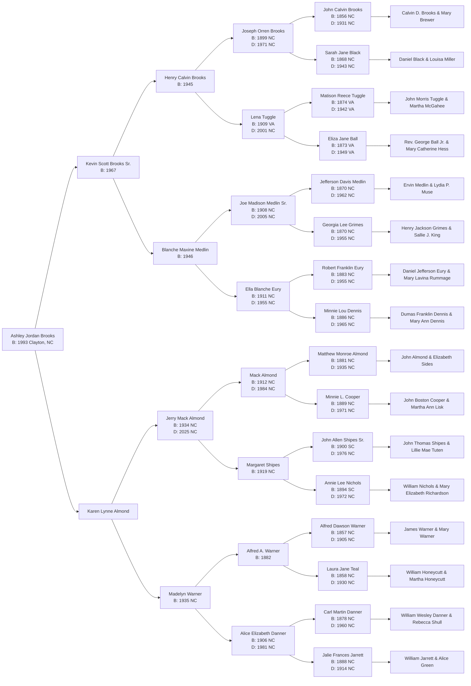

# Family Tree

Verified family history through **Generation 6 (3x Great-Grandparents)**. 

---

## 🌳 Jeremy Daniel Wood's Pedigree

```mermaid
graph LR
    J[Jeremy Daniel Wood<br/>B: 1992 Wilmington, NC]
    
    J --> F[Jason Bard Waters<br/>B: 1970<br/>M: 1990 Charlotte, NC]
    J --> M[Kimberly Wood<br/>B: 1975]
    
    F --> FF[Mike Waters<br/>B: 1946]
    F --> FM[Sandra Waters<br/>B: 1947]
    
    FF --> FFF[Gerald Lee Waters]
    FF --> FFM[Mary Mae Lewis]
    
    FFF --> FFFF[Oscar Rae Waters<br/>B: 1890 Dukes, FL<br/>D: 1965 Brooker, FL]
    FFF --> FFFM[Essie Rae Malphurs<br/>B: 1894 Brooker, FL<br/>D: 1972 Lakeland, FL]
    
    FFFF --> FFFFF[James Que Waters<br/>B: 1857 GA<br/>D: 1940 FL]
    FFFF --> FFFFM[Martha Thomas<br/>B: 1864 GA<br/>D: 1939 FL]
    FFFM --> FFFMF[William Daniel Malphurs<br/>B: 1866 FL<br/>D: 1945 FL]
    FFFM --> FFFMM[Janie Fowler<br/>B: 1867 FL<br/>D: 1945 FL]
    
    FFM --> FFMF[Landon T. Lewis<br/>B: 1879 TN<br/>D: 1966 TN]
    FFM --> FFMM[Lena Beatrice Smith<br/>B: 1890 TN<br/>D: 1991 TN]
    
    FFMF --> FFMFF[James Murray Lewis<br/>B: 1855 TN<br/>D: 1923 TN]
    FFMF --> FFMFM[Judith Eveline Heatherly<br/>B: 1853 TN<br/>D: 1936 TN]
    FFMM --> FFMMF[John Madison Smith Jr.<br/>B: 1862 TN<br/>D: 1924 TN]
    FFMM --> FFMMM[Olive Pillsbury Traver<br/>B: 1867 VT<br/>D: 1955 TN]

    FM --> FMF[Clyde Jones Jr.<br/>B: 1914<br/>D: 2011 TN]
    FM --> FMM[Rose Mary Jones<br/>B: 1924<br/>D: 2013]
    
    FMF --> FMFF[Clyde Jones Sr.<br/>B: 1887 NC<br/>D: 1962 TN]
    FMF --> FMFM[Maude Elma Matney<br/>B: 1893 NC<br/>D: 1984 TN]
    
    FMFF --> FMFFF[Henry Raymond Jones<br/>B: 1853 NC<br/>D: 1936]
    FMFF --> FMFFM[Charlotte Deane Vance<br/>B: 1859 NC<br/>D: 1945]
    FMFM --> FMFMF[Martin Luther Matney<br/>B: 1853 NC<br/>D: 1938]
    FMFM --> FMFMM[Susan Margaret Loudermilk<br/>B: 1858 NC<br/>D: 1934]
    
    FMM --> FMMF[Anthony Emil Kruppa<br/>B: 1896 Slovakia<br/>D: 1970 PA]
    FMM --> FMMM[Rozalia Szelesova<br/>B: 1895 Slovakia<br/>D: 1988]
    
    FMMF --> FMMFF[Janos Kruppa<br/>B: 1825 Slovakia]
    FMMM --> FMMMF[Janos Szeles<br/>Slovakia]

    M --> MF[John Wood<br/>B: 1945]
    M --> MM[Diane B. Wood<br/>B: 1946]
    
    MF --> MFF[John Perry Wood Sr.<br/>B: 1906 NC<br/>D: 1955 NC]
    MF --> MFM[Magnolia 'Maggie' Arnold<br/>B: 1913 NC<br/>D: 1974 NC]
    
    MFF --> MFFF[John Riley Wood<br/>B: 1870 NC<br/>D: 1946 NC]
    MFF --> MFFM[Margaret Delaney Champion<br/>B: 1881 NC<br/>D: 1955 NC]
    
    MFFF --> MFFFF[Mark John Wood<br/>B: 1834 NC<br/>D: 1907 NC]
    MFFF --> MFFFM[Rebecca Smith Wood<br/>B: 1827 NC<br/>D: 1922 NC]
    MFFM --> MFFMF[James Hinton Champion<br/>B: 1853 NC<br/>D: 1934 NC]
    MFFM --> MFFMM[Mary Jane Wood<br/>B: 1865 NC<br/>D: 1951 NC]
    
    MFM --> MFMF[Lonnie Frank Arnold Sr.<br/>B: 1866 NC<br/>D: 1948 NC]
    MFM --> MFMM[Magnolia Catherine Tutor<br/>B: 1883 NC<br/>D: 1972 NC]
    
    MFMF --> MFMFF[Thomas Harvill Arnold<br/>B: 1842 NC<br/>D: 1904 NC]
    MFMF --> MFMFM[Elizabeth Betsy Rebecca Newell<br/>B: 1841 NC<br/>D: 1908 NC]
    MFMFF --> MFMF FF[William Arnold & Nancy Ipock]
    MFMFM --> MFMF MF[William Newell & Elizabeth]
    
    MFMM --> MFMMF[Alfred Young Tutor<br/>B: 1852 NC<br/>D: 1940 NC]
    MFMM --> MFMMM[Charlotte 'Lottie' Honeycutt<br/>B: 1858 NC<br/>D: 1941 NC]
    MFMMF --> MFMM FF[William Madison Tutor & Harriet]
    MFMMM --> MFMM MF[William Honeycutt & Martha]

    MM --> MMF[Jesse Alton Brown<br/>B: 1923 NC<br/>D: 1992 NC]
    MM --> MMM[Lizzie Briley<br/>B: 1896]
    
    MMF --> MMFF[Jessie M. Brown<br/>B: 1896]
    MMF --> MMFM[Mississippi Carson<br/>B: 1858<br/>D: 1932]

    click J "Jeremy_Wood.md"
    click F "Jason_Bard_Waters.md"
    click M "Kimberly_Wood.md"
    click FF "Mike_Waters.md"
    click FM "Sandra_Waters.md"
    click FFF "Gerald_Lee_Waters.md"
    click FFM "Mary_Mae_Lewis.md"
    click FFFF "Oscar_Rae_Waters.md"
    click FFFM "Essie_Rae_Malphurs.md"
    click FFFFF "James_Que_Waters.md"
    click FFFFM "Martha_Louise_Thomas.md"
    click FFFMF "William_Daniel_Malphurs.md"
    click FFFMM "Janie_Fowler.md"
    click FFMF "Landon_T_Lewis.md"
    click FFMM "Lena_Beatrice_Smith.md"
    click FFMFF "James_Murray_Lewis.md"
    click FFMFM "Judith_Eveline_Heatherly.md"
    click FFMMF "John_Madison_Smith_Jr.md"
    click FFMMM "Olive_Pillsbury_Traver.md"
    click FMF "Clyde_Jones_Jr.md"
    click FMM "Rose_Mary_Jones.md"
    click FMFF "Clyde_Jones_Sr.md"
    click FMFM "Maude_Matney.md"
    click FMFFF "Henry_Raymond_Jones_Sr.md"
    click FMFFM "Charlotte_Diane_Vance.md"
    click FMFMF "Martin_Luther_Matney.md"
    click FMFMM "Susan_Margaret_Loudermilk.md"
    click FMMF "Anthony_Krupa.md"
    click FMMM "Rose_Szeles.md"
    click FMMFF "Joannes_Krupa.md"
    click FMMMF "Janos_Szeles.md"
    click MF "John_Wood.md"
    click MM "Diane_B_Wood.md"
    click MFF "John_Perry_Wood_Sr.md"
    click MFM "Magnolia_Maggie_Arnold.md"
    click MFFF "John_Riley_Wood.md"
    click MFFM "Margaret_Delaney_Champion.md"
    click MFFFF "Mark_John_Wood.md"
    click MFFFM "Rebecca_Smith.md"
    click MFFMF "James_Hinton_Champion.md"
    click MFFMM "Mary_Jane_Wood.md"
    click MFMF "Lonnie_Frank_Arnold_Sr.md"
    click MFMM "Magnolia_Catherine_Tutor.md"
    click MFMFF "Thomas_Harvill_Arnold.md"
    click MFMFM "Elizabeth_Betsy_Rebecca_Newell.md"
    click MFMMF "Alfred_Young_Tutor.md"
    click MFMMM "Charlotte_Lottie_Honeycutt.md"
    click MMF "Jesse_Alton_Brown.md"
    click MMM "Lizzie_Briley.md"
    click MMFF "Jessie_M_Brown.md"
    click MMFM "Mississippi_Carson.md"
```

---

## 🌳 Ashley Jordan Brooks's Pedigree


